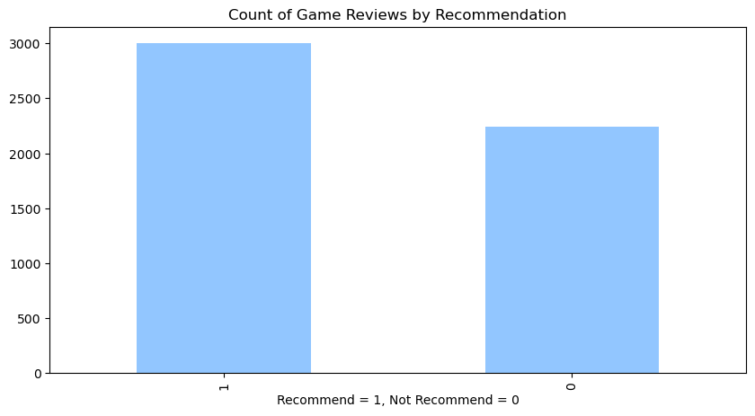
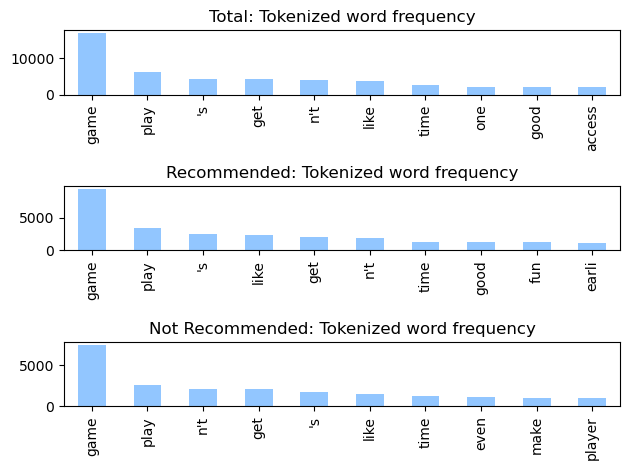
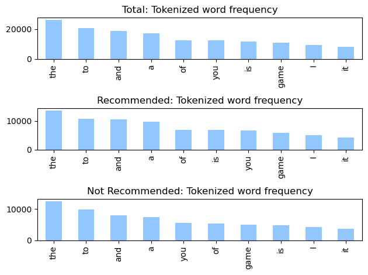
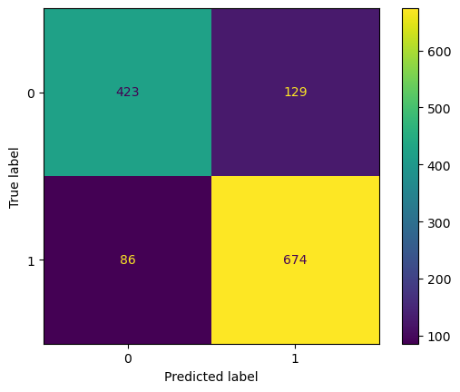

# HHS CS Workshop: Bag-of-words Model
Using bag-of-words model for basic sentiment analysis (of steam game reviews).  
[Workshop slides](https://github.com/BaroqueObama/hhs-ws-bag-of-words/blob/main/GM11.pdf)  
## Code:
**Goal:** Try to predict whether or not a user recommends a game based on their game review.  
### Data
25.5k reviews + recommendations for games on Steam. Taken from [Kaggle](https://www.kaggle.com/datasets/piyushagni5/sentiment-analysis-for-steam-reviews).  
Contains `review_id`, `title`, `year`, `user_review`, and `user_suggestion` but we will only be using **`user_review`** (full text of the review posted by a user) and **`user_suggestion`** (game marked recommended: 1 and not recommended: 0 by the user).  

Distribution between Recommended and Not Recommended game reviews:  
  

(Also includes dataset on Starbucks reviews from [Kaggle](https://www.kaggle.com/datasets/harshalhonde/starbucks-reviews-dataset))
### Tokenize Strings using `nltk`
- Split text into tokens using `nltk.word_tokenize`.
- Remove stop words contained in `stopwords.words`.
- Perform stemming to homogenize words using `PorterStemmer()`.
- Remove punctuation contained in `string.punctuation`.  

**Good Tokenization:**  


<details>
  <summary>Bad Tokenization (Click to Expand)</summary>


</details>

### MultiLabelBinarizer
Create a binary matrix indicating the presence or absence of a token using `MultiLabelBinarizer` from `sklearn.preprocessing`.  
### Naive Bayes Classifier
Create Naive Bayes classifier for multinomial models using the binary matrix with `MultinomialNB()` from `sklearn.naive_bayes`.  
### Evaluate Model
Accuracy: 0.8201219512195121 (using `accuracy_score` from `sklearn.metrics`)  
Confusion Matrix (using `ConfusionMatrixDisplay` from `sklearn.metrics`):  

## Example Usage:
### Case 1:
```
comment = "I saw a dog that looked more realistic than my actual dog 10/10"
print(try_advanced_model(comment))
```
Output:
```
Model predicts: Recommend
Tokens: ['saw', 'dog', 'look', 'realist', 'actual', 'dog', '10/10']
```
### Case 2:
```
comment = "This was recommended to me and now I have trust issues."
print(try_advanced_model(comment))
```
Output:
```
Model predicts: Recommend
Tokens: ['recommend', 'trust', 'issu']
```
### Case 3:
```
comment = "The actual zombie apocalypse will happen before this game is done"
print(try_advanced_model(comment))
```
Output:
```
Model predicts: Does Not Recommend
Tokens: ['actual', 'zombi', 'apocalyps', 'happen', 'game', 'done']
```